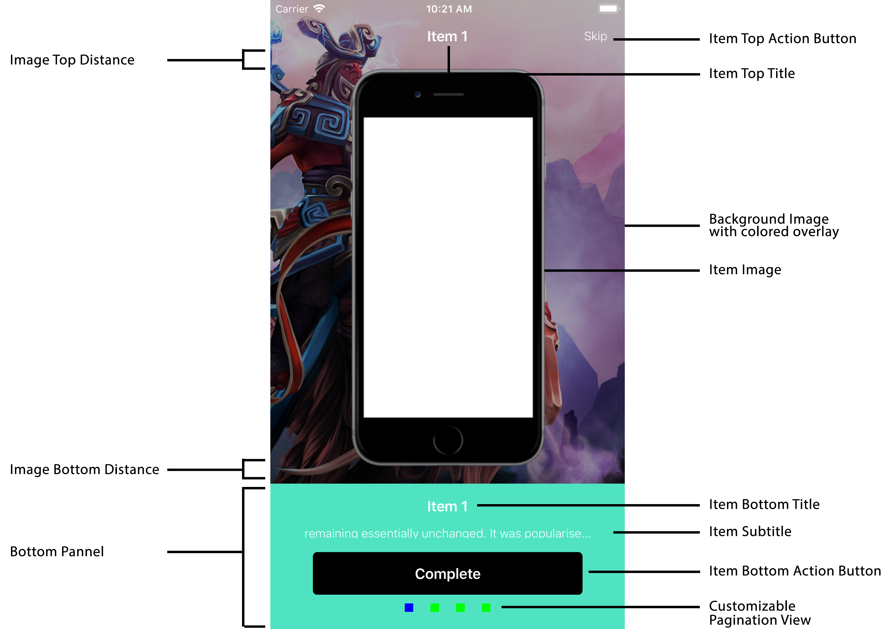
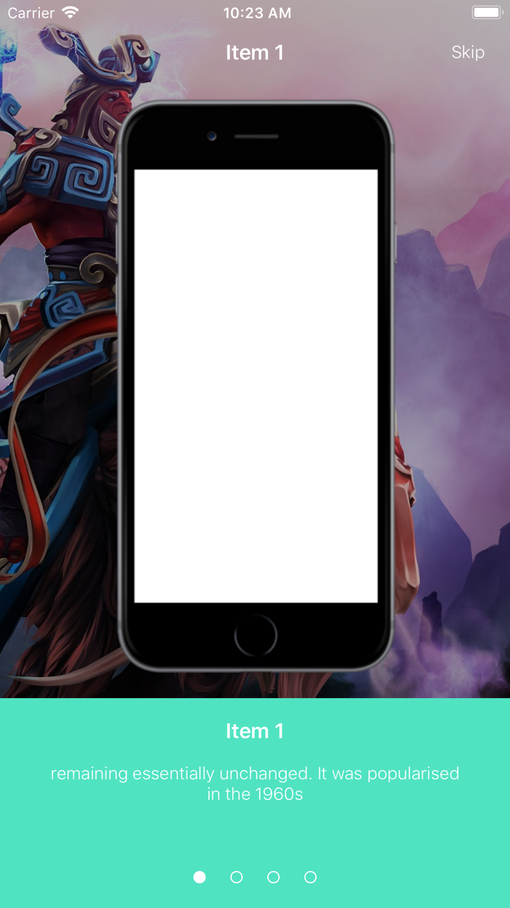

# TDOnboarding

[](https://travis-ci.org/Anh Phan Tran/TDOnboarding)
[](https://cocoapods.org/pods/TDOnboarding)
[](https://cocoapods.org/pods/TDOnboarding)
[](https://cocoapods.org/pods/TDOnboarding)

## Example

To run the example project, clone the repo, and run `pod install` from the Example directory first.

## Requirements

Swift 4
iOS 9.0

## Installation

TDOnboarding is available through [CocoaPods](http://cocoapods.org). To install
it, simply add the following lines to your Podfile:

```ruby
pod 'TDOnboarding'
```

## Usage

TDOnboarding lets you quickly setup a new onboarding using  ```[TDOnboadingItem]``` and present the onboading.

All you need to do is provide the items and options for the onboarding through its initializer:

```swift
let onboarding = TDOnboarding(items: items, options: ExampleOnboardingOptions())
onboarding.present(from: self, completion: nil)
```

### TDOnboardingItem

Each onboarding item must conform to the TDOnboardingItem protocol, which is defined as:

```swift
public protocol TDOnboardingItem {
    var image: UIImage { get }
    var subtitle: NSAttributedString { get }
    var topTitle: NSAttributedString? { get }
    var bottomTitle: NSAttributedString? { get }
    var topActionButtonTitle: NSAttributedString? { get }
    var bottomActionButtonTitle: NSAttributedString? { get }
}
```
### TDOnboadingOptions

This is a protocol that lets you quickly configure the onboarding screen, it also includes default values for standard "The Distance" onboarding style, you should return nil to get defaul values. This enable easy extension to this library by adding more configurables to the enums.

The options includes:

```swift
public protocol TDOnboardingOptions {
    var defaultBackgroundImage: UIImage { get }
    var statusBarStyle: UIStatusBarStyle { get }
    var paginationCell: TDOnboardingPaginationCell.Type { get }
    func measure(for component: TDOnboardingMeasurableComponent) -> CGFloat?
    func configure(for component: TDOnboardingConfigurableComponent)
    func color(for component: TDOnboardingColorizableComponent) -> UIColor?
}

public enum TDOnboardingMeasurableComponent {
    case bottomPanelHeight
    case imageTopDistance
    case imageBottomDistance
    case bottomActionButtonWidth
}

public enum TDOnboardingColorizableComponent {
    case paginationItem
    case backgroundImageOverlay
    case bottomPanel
}

public enum TDOnboardingConfigurableComponent {
    case topActionButton(UIButton)
    case bottomActionButton(UIButton)
    case backgroundImageView(UIImageView)
}
```

### Custom Pagination View:
The library comes with default pagination view, however, you can create your own by creating and extending a collectionview cell with TDOnboardingPaginationCell

```swift
public protocol TDOnboardingPaginationCell {
    static var identifier: String { get }
    static var nib: UINib { get }
    func configure(for index: Int, isSelected: Bool, options: TDOnboardingOptions?)
}
```

The cell height max is 10pt.

The pagination view will automatically center the cells inside horizontally.

After that, all you need is provide the cell in the options:

```swift
struct ExampleOnboardingOptions: TDOnboardingOptions {
    ... // Other options
    var paginationCell: TDOnboardingPaginationCell.Type {
        return CustomPaginationItemCell.self
    }
}
```

### Components with configurations


### Default Onboarding:


### Delegation:

TDOnboarding provide delegation for button actions in the onboarding screen:

```swift
...
let onboarding = TDOnboarding(items: items, options: ExampleOnboardingOptions())
onboarding.delegate = self
onboarding.present(from: self, completion: nil)
```

```swift
public protocol TDOnboardingDelegate: class {
    func topActionButtonTapped(on onboarding: TDOnboarding, itemIndex: Int)
    func bottomActionButtonTapped(on onboarding: TDOnboarding, itemIndex: Int)
}
```

## Author

Anh Phan Tran, anh@thedistance.co.uk

## License

TDOnboarding is available under the MIT license. See the LICENSE file for more info.
